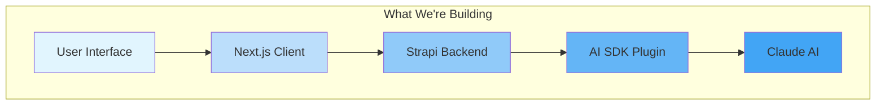
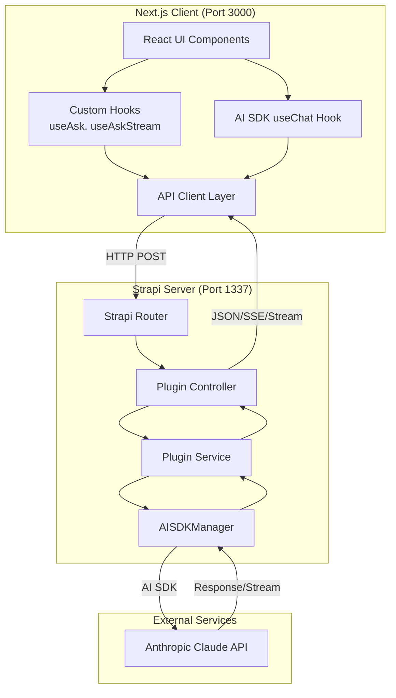
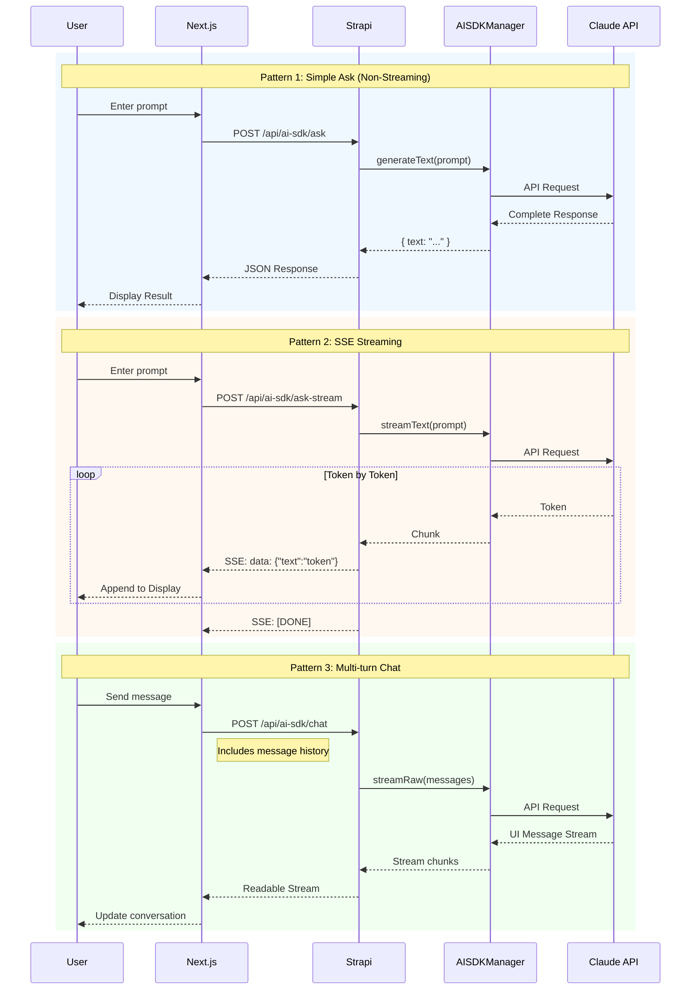
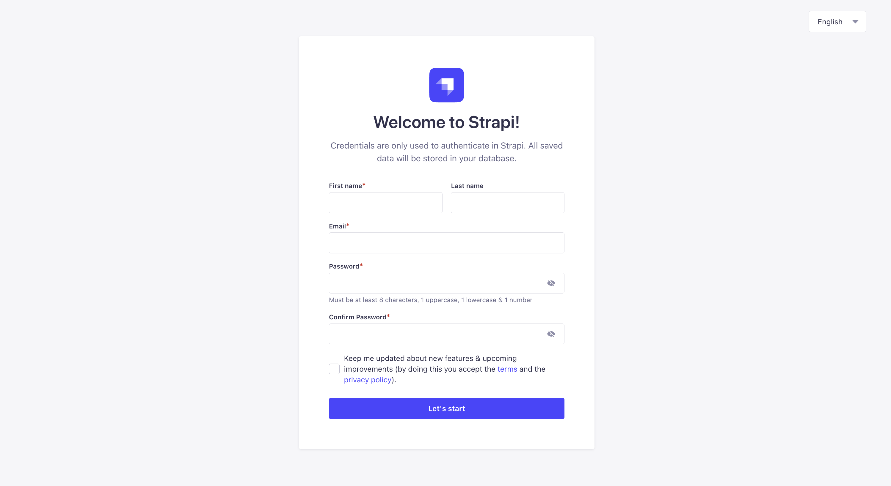
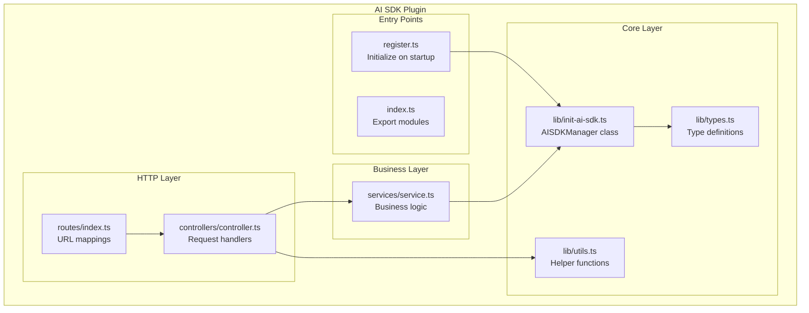
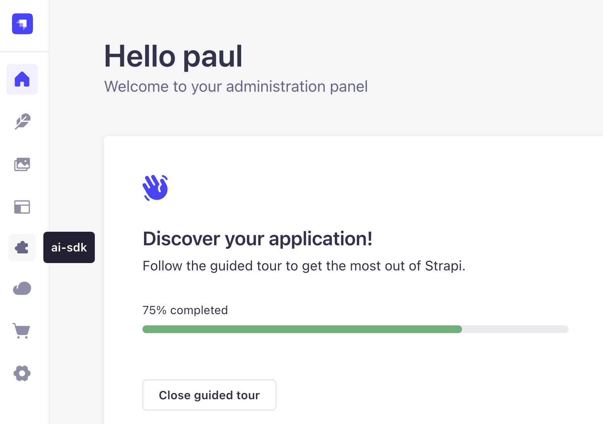
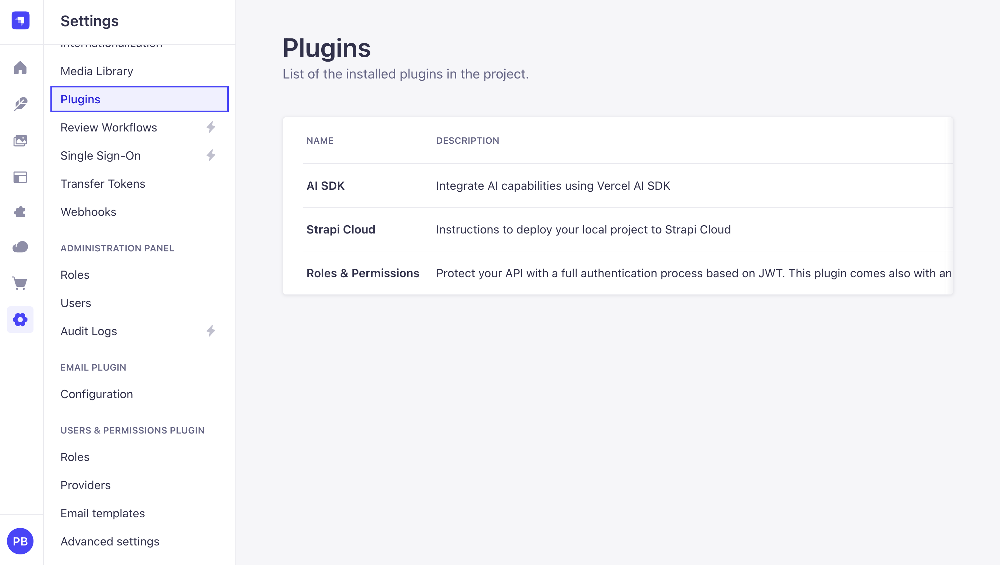
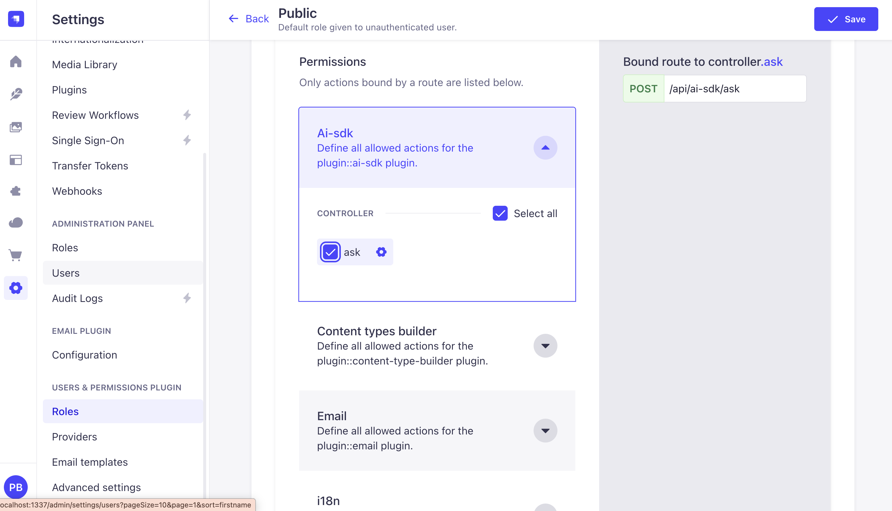
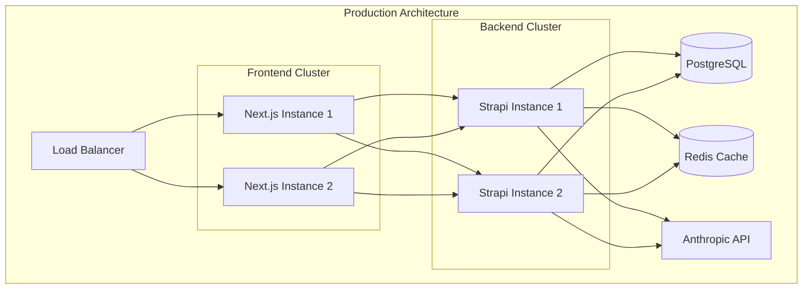

# Building an AI-Powered Application with Strapi and Next.js

A guide to building a full-stack AI chat application using Strapi 5, Vercel AI SDK, Anthropic Claude, and Next.js.

---

## Table of Contents

1. [What We're Building](#what-were-building)
2. [Architecture Overview](#architecture-overview)
3. [Technology Stack](#technology-stack)
4. [Part 1: Setting Up Strapi](#part-1-setting-up-strapi)
5. [Part 2: Building the AI SDK Plugin](#part-2-building-the-ai-sdk-plugin)
6. [Part 3: Next.js Client Implementation](#part-3-nextjs-client-implementation)
7. [Testing & Debugging](#testing--debugging)
8. [Deployment Considerations](#deployment-considerations)

---

## What We're Building

This tutorial walks you through building a production-ready AI chat application that demonstrates three different patterns for integrating Large Language Models (LLMs) into web applications:

1. **Simple Ask** - Send a prompt, receive a complete response
2. **Streaming Response** - Real-time token-by-token streaming via Server-Sent Events (SSE)
3. **Multi-turn Chat** - Full conversational interface with message history



### Key Features

- **Modular Plugin Architecture** - Reusable Strapi plugin for AI capabilities
- **Multiple Streaming Patterns** - SSE and UI Message Stream protocols
- **Type-Safe** - Full TypeScript across frontend and backend
- **Production-Ready** - Error handling, validation, and proper abstraction layers

---

## Architecture Overview

### System Architecture



### Request Flow Patterns



### Project Structure

```
ai-sdk/
├── server/                          # Strapi Backend
│   ├── config/
│   │   ├── plugins.ts               # Plugin configuration
│   │   ├── database.ts              # Database settings
│   │   └── server.ts                # Server settings
│   ├── src/
│   │   └── plugins/
│   │       └── ai-sdk/              # Our AI SDK Plugin
│   │           ├── admin/           # Admin UI components
│   │           └── server/          # Backend logic
│   │               ├── src/
│   │               │   ├── controllers/
│   │               │   ├── services/
│   │               │   ├── routes/
│   │               │   └── lib/     # AI SDK integration
│   │               └── package.json
│   ├── .env                         # Environment variables
│   └── package.json
│
├── next-client/                     # Next.js Frontend
│   ├── app/
│   │   ├── layout.tsx               # Root layout
│   │   └── page.tsx                 # Home page
│   ├── components/
│   │   ├── AskExample.tsx           # Non-streaming demo
│   │   ├── AskStreamExample.tsx     # SSE streaming demo
│   │   └── ChatExample.tsx          # Chat interface demo
│   ├── hooks/
│   │   ├── useAsk.ts                # Non-streaming hook
│   │   └── useAskStream.ts          # Streaming hook
│   ├── lib/
│   │   └── api.ts                   # API client functions
│   └── package.json
│
└── docs/                            # Documentation
    └── TUTORIAL.md                  # This file
```

---

## Technology Stack

### Backend (Strapi Server)

| Technology            | Version | Purpose                         |
| --------------------- | ------- | ------------------------------- |
| **Strapi**            | 5.33.3  | Headless CMS framework          |
| **AI SDK**            | 6.0.39  | Vercel's unified AI SDK         |
| **@ai-sdk/anthropic** | 3.0.15  | Anthropic provider for AI SDK   |
| **TypeScript**        | 5.x     | Type-safe development           |
| **SQLite**            | -       | Default database (configurable) |

### Frontend (Next.js Client)

| Technology        | Version | Purpose                |
| ----------------- | ------- | ---------------------- |
| **Next.js**       | 16.1.3  | React framework        |
| **React**         | 19.2.3  | UI library             |
| **@ai-sdk/react** | 3.0.41  | React hooks for AI SDK |
| **Tailwind CSS**  | 4.x     | Utility-first styling  |
| **TypeScript**    | 5.x     | Type-safe development  |

### AI Services

| Service              | Model                    | Purpose     |
| -------------------- | ------------------------ | ----------- |
| **Anthropic Claude** | claude-sonnet-4-20250514 | Primary LLM |

### Important: UIMessage vs ModelMessage (AI SDK v6)

In AI SDK v6, there are two distinct message formats:

| Format           | Used By                        | Structure                                       |
| ---------------- | ------------------------------ | ----------------------------------------------- |
| **UIMessage**    | `useChat` hook, frontend state | `{ id, role, parts: [{ type: "text", text }] }` |
| **ModelMessage** | `streamText`, `generateText`   | `{ role, content }`                             |

The `useChat` hook manages conversation state using **UIMessage** format (richer, includes IDs and parts). However, the AI SDK's `streamText` function expects **ModelMessage** format.

Use `convertToModelMessages(uiMessages)` to convert between them:

```typescript
import { convertToModelMessages, type UIMessage } from "ai";

// In your service layer
async chat(messages: UIMessage[]) {
  const modelMessages = await convertToModelMessages(messages);
  return streamText({ model, messages: modelMessages });
}
```

> **Note:** `convertToModelMessages` is async in AI SDK v6 to support async `Tool.toModelOutput()`.

---

## Part 1: Setting Up Strapi

**Note**: make sure to use Node 22 (lts version)

// TODO: Show how to set it up with NVM also link to NVM setup guide just in case

### Step 1.1: Create a New Strapi Project

```bash
# Create a new Strapi project
npx create-strapi@latest server
```

Complete the following questions:

```bash
paul@dev test npx create-strapi-app@latest server

 Strapi   v5.33.3 🚀 Let's create your new project

🚀 Welcome to Strapi! Ready to bring your project to life?

Create a free account and get:
30 days of access to the Growth plan, which includes:
✨ Strapi AI: content-type builder, media library and translations
✅ Live Preview
✅ Single Sign-On (SSO) login
✅ Content History
✅ Releases

? Please log in or sign up. Skip
? Do you want to use the default database (sqlite) ? Yes
? Start with an example structure & data? No
? Start with Typescript? Yes
? Install dependencies with npm? Yes
? Initialize a git repository? Yes
? Participate in anonymous A/B testing (to improve Strapi)? No

 Strapi   Creating a new application at /Users/paul/test/server
```

```bash
# Navigate to the project
cd server
```

### Step 1.2: Project Structure After Creation

```
server/
├── config/
│   ├── admin.ts
│   ├── api.ts
│   ├── database.ts
│   ├── middlewares.ts
│   ├── plugins.ts
│   └── server.ts
├── database/
├── public/
├── src/
│   └── admin/
├── types/
├── .env
├── .env.example
├── package.json
└── tsconfig.json
```

### Step 1.3: Configure Environment Variables

Create or update your `.env` file:

```env
# Server
HOST=0.0.0.0
PORT=1337

# Secrets (generate with: openssl rand -base64 32)
APP_KEYS=your-app-keys-here
API_TOKEN_SALT=your-api-token-salt
ADMIN_JWT_SECRET=your-admin-jwt-secret
TRANSFER_TOKEN_SALT=your-transfer-token-salt
JWT_SECRET=your-jwt-secret

# Database (for SQLite)
DATABASE_CLIENT=sqlite
DATABASE_FILENAME=.tmp/data.db

# AI SDK Configuration ( you can use any provider, I chose to use Anthropic)
ANTHROPIC_API_KEY=sk-ant-your-api-key-here
ANTHROPIC_MODEL=claude-sonnet-4-20250514
```

### Step 1.4: Verify Strapi Installation

```bash
# Start the development server
cd server
yarn dev
```

Visit `http://localhost:1337` to create your admin account.



Once you have created your **Admin User** you will be greeted by the Strapi Admin area.

If you have never used Strapi checkout this [Crash Course Tutorial](https://www.youtube.com/watch?v=t1iUuap7vhw) that I have created.

## Part 2: Building the AI SDK Plugin (Our first Strapi Plugin)

This is the core of our implementation - a Strapi plugin that integrates the Vercel AI SDK with Anthropic Claude.

### Plugin Architecture



### Step 2.1: Using Strapi Plugin SDK to Scaffold Our Plugin

We'll use the official [Strapi Plugin SDK](https://github.com/strapi/sdk-plugin) to scaffold our plugin. This CLI toolkit provides a complete project structure with all necessary configuration files.

```bash
# From the server directory, run the plugin init command
cd server
npx @strapi/sdk-plugin@latest init ai-sdk
```

You'll be prompted with several questions. Here are the recommended answers for our AI SDK plugin:

```
npx @strapi/sdk-plugin@latest init ai-sdk
[INFO]  Creating a new package at:  src/plugins/ai-sdk
✔ plugin name … ai-sdk
✔ plugin display name … AI SDK
✔ plugin description … Integrate AI capabilities using Vercel AI SDK
✔ plugin author name … Paul Bratslavsky
✔ plugin author email … paul.bratslavsky@strapi.io
✔ git url …
✔ plugin license … MIT
✔ register with the admin panel? … yes
✔ register with the server? … yes
✔ use editorconfig? … yes
✔ use eslint? … yes
✔ use prettier? … yes
✔ use typescript? … yes
```

> **Important:** Make sure to answer **Yes** to both "register with the admin panel" and "register with the server" since our plugin needs backend API routes.

Once this process is done, you will see the following message:

```bash
You can now enable your plugin by adding the following in ./config/plugins.ts
───────────────────────────────────
export default {
  // ...
  'ai-sdk': {
    enabled: true,
    resolve: './src/plugins/ai-sdk'
  },
  // ...
}
───────────────────────────────────

[INFO] Plugin generated successfully.
```

Go ahead and do that now.

Now let's install our dependencies and build out plugin for the first time.

```bash
# Navigate to the plugin directory
server cd src/plugins/ai-sdk
yarn build
```

You can also start your plugin in watch mode with the following command:

```bash
yarn watch
```

Then restart your Strapi application by running `yarn dev` in the root and you should see the following.

**Should show up in Menu**



**Should show up in Settings**



Now that we know our basic plugin structure is set up, lets start by installing all the required dependencies.

### Step 2.2 Install the AI SDK dependencies

Make sure to run this in the `src/plugins/ai-sdk` folder:

```bash
yarn add  @ai-sdk/anthropic ai
```

**Note**: Don't forget to rebuild your plugin and restart the Strapi application to apply the changes.

### Step 2.3: Plugin Structure Overview

After scaffolding, your plugin structure will look like this:

```
src/plugins/ai-sdk/
├── admin/
│   └── src/
│       ├── components/          # Admin UI components (generated)
│       ├── pages/               # Admin pages (generated)
│       └── index.ts             # Admin entry point
├── server/
│   └── src/
│       ├── controllers/         # We'll add our API controllers here
│       ├── services/            # We'll add our service layer here
│       ├── routes/              # We'll add our routes here
│       └── index.ts             # Server entry point
├── package.json
├── tsconfig.json
└── README.md
```

Now let's create the additional directories we need for our implementation.

Run the following in the root folder of your plugin:

```bash
# Create the lib directory for our core AI SDK integration
mkdir -p server/src/lib
mkdir -p server/src/routes/content-api
```

We will cover these in detail in a bit.

---

## Phase 1: Plugin Configuration & Initialization

Let's update plugin config to initialize and connect to the Anthropic API. We'll verify it works before adding any endpoints.

### Step 2.4: Configure the Plugin in Strapi

First, let's tell Strapi about our plugin and pass it the API key. Update `config/plugins.ts` in your Strapi root:

```typescript
export default ({ env }) => ({
  "ai-sdk": {
    enabled: true,
    resolve: "./src/plugins/ai-sdk",
    config: {
      anthropicApiKey: env("ANTHROPIC_API_KEY"),
      chatModel: env("ANTHROPIC_MODEL", "claude-sonnet-4-20250514"),
    },
  },
});
```

Make sure your `.env` file has the API key:

```env
ANTHROPIC_API_KEY=sk-ant-your-api-key-here
ANTHROPIC_MODEL=claude-sonnet-4-20250514
```

### Step 2.5: Create Basic Types

Create `src/plugins/ai-sdk/server/src/lib/types.ts` with just what we need for initialization:

```typescript
/**
 * Supported Claude model names
 */
export const CHAT_MODELS = [
  "claude-sonnet-4-20250514",
  "claude-opus-4-20250514",
  "claude-3-5-sonnet-20241022",
  "claude-3-5-haiku-20241022",
  "claude-3-haiku-20240307",
] as const;

export type ChatModelName = (typeof CHAT_MODELS)[number];
export const DEFAULT_MODEL: ChatModelName = "claude-sonnet-4-20250514";

/**
 * Plugin configuration interface
 */
export interface PluginConfig {
  anthropicApiKey: string;
  chatModel?: ChatModelName;
  baseURL?: string;
}
```

We'll add more types as we need them in later phases.

### Step 2.6: Create the AI SDK Manager (Basic Version)

Create `src/plugins/ai-sdk/server/src/lib/init-ai-sdk.ts`. We'll start with just initialization - no AI calls yet:

```typescript
import { createAnthropic, type AnthropicProvider } from "@ai-sdk/anthropic";
import {
  CHAT_MODELS,
  DEFAULT_MODEL,
  type PluginConfig,
  type ChatModelName,
} from "./types";

/**
 * AISDKManager - Core class for AI SDK integration
 * We'll add AI methods in the next phase
 */
class AISDKManager {
  private provider: AnthropicProvider | null = null;
  private model: ChatModelName = DEFAULT_MODEL;

  /**
   * Initialize the manager with plugin configuration
   * Returns false if config is missing required fields
   */
  initialize(config: unknown): boolean {
    const cfg = config as Partial<PluginConfig> | undefined;

    if (!cfg?.anthropicApiKey) {
      return false;
    }

    this.provider = createAnthropic({
      apiKey: cfg.anthropicApiKey,
      baseURL: cfg.baseURL,
    });

    if (cfg.chatModel && CHAT_MODELS.includes(cfg.chatModel)) {
      this.model = cfg.chatModel;
    }

    return true;
  }

  getChatModel(): ChatModelName {
    return this.model;
  }

  isInitialized(): boolean {
    return this.provider !== null;
  }
}

export const aiSDKManager = new AISDKManager();
```

### Step 2.7: Create the Register Hook

Create `src/plugins/ai-sdk/server/src/register.ts`. This runs when Strapi starts:

```typescript
import type { Core } from "@strapi/strapi";
import { aiSDKManager } from "./lib/init-ai-sdk";

const register = ({ strapi }: { strapi: Core.Strapi }) => {
  const config = strapi.config.get("plugin::ai-sdk");
  const initialized = aiSDKManager.initialize(config);

  if (!initialized) {
    strapi.log.warn(
      "AI SDK plugin: anthropicApiKey not configured, plugin will not be initialized",
    );
    return;
  }

  strapi.log.info(
    `AI SDK plugin initialized with model: ${aiSDKManager.getChatModel()}`,
  );
};

export default register;
```

### Step 2.8: Verify Plugin Initialization

Rebuild and start Strapi:

```bash
yarn build
yarn develop
```

Check the console. You will see:

```bash
[2026-01-18 16:10:49.069] warn: AI SDK plugin: anthropicApiKey not configured, plugin will not be initialized
```

We need to add our credentials to our `.env` file:

```env
ANTHROPIC_API_KEY=your_api_key
```

Now, restart and you should see the following message:

```bash
[2026-01-18 16:15:50.508] info: AI SDK plugin initialized with model: claude-sonnet-4-20250514
```

---

## Phase 2: Basic Text Generation (Non-Streaming)

Now let's add our first AI endpoint.

### Step 2.9: Add generateText to AISDKManager

Update `src/plugins/ai-sdk/server/src/lib/init-ai-sdk.ts` to add text generation capabilities.

**Add to imports:**

```typescript
import { generateText, type LanguageModel } from "ai";
```

**Add these methods to the AISDKManager class** (before `getChatModel()`):

```typescript
  private getLanguageModel(): LanguageModel {
    if (!this.provider) {
      throw new Error('AI SDK Manager not initialized');
    }
    return this.provider(this.model);
  }

  async generateText(prompt: string, options?: { system?: string }) {
    const result = await generateText({
      model: this.getLanguageModel(),
      prompt,
      system: options?.system,
    });
    return { text: result.text };
  }
```

Your file should now look like this:

```typescript
import { createAnthropic, type AnthropicProvider } from "@ai-sdk/anthropic";
import { generateText, type LanguageModel } from "ai"; // ← Added
import {
  CHAT_MODELS,
  DEFAULT_MODEL,
  type PluginConfig,
  type ChatModelName,
} from "./types";

class AISDKManager {
  private provider: AnthropicProvider | null = null;
  private model: ChatModelName = DEFAULT_MODEL;

  initialize(config: unknown): boolean {
    const cfg = config as Partial<PluginConfig> | undefined;

    if (!cfg?.anthropicApiKey) {
      return false;
    }

    this.provider = createAnthropic({
      apiKey: cfg.anthropicApiKey,
      baseURL: cfg.baseURL,
    });

    if (cfg.chatModel && CHAT_MODELS.includes(cfg.chatModel)) {
      this.model = cfg.chatModel;
    }

    return true;
  }

  // ↓ New method
  private getLanguageModel(): LanguageModel {
    if (!this.provider) {
      throw new Error("AI SDK Manager not initialized");
    }
    return this.provider(this.model);
  }

  // ↓ New method
  async generateText(prompt: string, options?: { system?: string }) {
    const result = await generateText({
      model: this.getLanguageModel(),
      prompt,
      system: options?.system,
    });
    return { text: result.text };
  }

  getChatModel(): ChatModelName {
    return this.model;
  }

  isInitialized(): boolean {
    return this.provider !== null;
  }
}

export const aiSDKManager = new AISDKManager();
```

### Step 2.10: Create the Service

Create `src/plugins/ai-sdk/server/src/services/service.ts`:

```typescript
import type { Core } from "@strapi/strapi";
import { aiSDKManager } from "../lib/init-ai-sdk";

const service = ({ strapi }: { strapi: Core.Strapi }) => ({
  async ask(prompt: string, options?: { system?: string }) {
    const result = await aiSDKManager.generateText(prompt, options);
    return result.text;
  },

  isInitialized() {
    return aiSDKManager.isInitialized();
  },
});

export default service;
```

### Step 2.11: Create the Controller

Create `src/plugins/ai-sdk/server/src/controllers/controller.ts`:

```typescript
import type { Core } from "@strapi/strapi";
import type { Context } from "koa";

const controller = ({ strapi }: { strapi: Core.Strapi }) => ({
  async ask(ctx: Context) {
    const { prompt, system } = ctx.request.body as {
      prompt?: string;
      system?: string;
    };

    if (!prompt || typeof prompt !== "string") {
      ctx.badRequest("prompt is required and must be a string");
      return;
    }

    const service = strapi.plugin("ai-sdk").service("service");
    if (!service.isInitialized()) {
      ctx.badRequest("AI SDK not initialized");
      return;
    }

    const result = await service.ask(prompt, { system });
    ctx.body = { data: { text: result } };
  },
});

export default controller;
```

### Step 2.12: Create the Route

Create `src/plugins/ai-sdk/server/src/routes/content-api/index.ts`:

```typescript
export default {
  type: "content-api",
  routes: [
    {
      method: "POST",
      path: "/ask",
      handler: "controller.ask",
      config: { policies: [] },
    },
  ],
};
```

Create `src/plugins/ai-sdk/server/src/routes/index.ts`:

```typescript
import contentApi from "./content-api";

export default {
  "content-api": contentApi,
};
```

### Step 2.13: Test with curl

Rebuild, restart, and test:

```bash
curl -X POST http://localhost:1337/api/ai-sdk/ask \
  -H "Content-Type: application/json" \
  -d '{"prompt": "What is 2 + 2? Reply with just the number."}'
```

You will get the **Forbidden** message:

```json
{
  "data": null,
  "error": {
    "status": 403,
    "name": "ForbiddenError",
    "message": "Forbidden",
    "details": {}
  }
}
```

We need to first enable our API in Strapi:



Now, try again.

Expected response:

```json
{ "data": { "text": "4" } }
```

### Step 2.14: Write a Test for the Ask Endpoint

Create `tests/test-ask.mjs` in your Strapi project root:

```javascript
const API_URL = "http://localhost:1337/api/ai-sdk";

async function testAsk() {
  console.log("Testing /ask endpoint...\n");

  const response = await fetch(`${API_URL}/ask`, {
    method: "POST",
    headers: { "Content-Type": "application/json" },
    body: JSON.stringify({
      prompt: "What is Strapi and why should I use it?",
    }),
  });

  if (!response.ok) {
    console.error("Request failed:", response.status, response.statusText);
    const error = await response.text();
    console.error(error);
    process.exit(1);
  }

  const data = await response.json();
  console.log("Response:", JSON.stringify(data, null, 2));

  if (data.data?.text) {
    console.log("\n✅ Test passed!");
  } else {
    console.error("\n❌ Test failed: unexpected response format");
    process.exit(1);
  }
}

testAsk().catch(console.error);
```

Add the test script to your `package.json`:

```json
{
  "scripts": {
    "test:ask": "node tests/test-ask.mjs"
  }
}
```

Run the test:

```bash
yarn test:ask
```

Expected output:

```
Testing /ask endpoint...

Response: {
  "data": {
    "text": "Strapi is an open-source headless CMS..."
  }
}

✅ Test passed!
```

---

## Phase 3: Next.js Frontend

Now let's build a simple frontend to interact with our API.

### Step 3.1: Create Next.js App

In a separate directory (outside your Strapi project):

```bash
npx create-next-app@latest next-client
```

```bash
paul@dev test npx create-next-app@latest next-client
? Would you like to use the recommended Next.js defaults? › - Use arrow-keys. Return to submit.
❯   Yes, use recommended defaults
    TypeScript, ESLint, Tailwind CSS, App Router
    No, reuse previous settings
    No, customize settings

    Using npm.

Initializing project with template: app-tw 


Installing dependencies:
- next
- react
- react-dom

Installing devDependencies:
- @tailwindcss/postcss
- @types/node
- @types/react
- @types/react-dom
- eslint
- eslint-config-next
- tailwindcss
- typescript

added 357 packages, and audited 358 packages in 30s

142 packages are looking for funding
  run `npm fund` for details

found 0 vulnerabilities

Generating route types...
✓ Types generated successfully

Initialized a git repository.

Success! Created next-client at /Users/paul/test/next-client
```

### Step 3.2: Create the API Client

Create the `lib` folder and add `lib/api.ts`:

```typescript
const API_BASE = process.env.NEXT_PUBLIC_API_URL || "http://localhost:1337/api/ai-sdk";

// Simple fetch wrapper
export async function askAI(prompt: string, options?: { system?: string }) {
  const res = await fetch(`${API_BASE}/ask`, {
    method: "POST",
    headers: { "Content-Type": "application/json" },
    body: JSON.stringify({ prompt, ...options }),
  });

  if (!res.ok) {
    throw new Error(`API error: ${res.status}`);
  }

  const data = await res.json();
  return data.data?.text as string;
}

export { API_BASE };
```

### Step 3.3: Create the useAsk Hook

Create the `hooks` folder and add `hooks/useAsk.ts`:

```typescript
"use client";

import { useState, useCallback } from "react";
import { askAI } from "@/lib/api";

export function useAsk() {
  const [response, setResponse] = useState("");
  const [loading, setLoading] = useState(false);
  const [error, setError] = useState<Error | null>(null);

  const ask = useCallback(async (prompt: string, options?: { system?: string }) => {
    setLoading(true);
    setError(null);
    setResponse("");

    try {
      const text = await askAI(prompt, options);
      setResponse(text);
      return text;
    } catch (err) {
      const error = err instanceof Error ? err : new Error(String(err));
      setError(error);
      throw error;
    } finally {
      setLoading(false);
    }
  }, []);

  const reset = useCallback(() => {
    setResponse("");
    setError(null);
  }, []);

  return { ask, response, loading, error, reset };
}
```

Create `hooks/index.ts` to export the hook:

```typescript
export { useAsk } from "./useAsk";
```

### Step 3.4: Create the AskExample Component

Create the `components` folder and add `components/AskExample.tsx`:

```tsx
"use client";

import { useState } from "react";
import { useAsk } from "@/hooks";

export function AskExample() {
  const [prompt, setPrompt] = useState("What is the capital of France?");
  const { ask, response, loading, error } = useAsk();

  const handleSubmit = async (e: React.FormEvent) => {
    e.preventDefault();
    await ask(prompt);
  };

  return (
    <section className="bg-white dark:bg-zinc-900 rounded-lg p-6 shadow">
      <h2 className="text-xl font-semibold mb-4 text-black dark:text-white">
        /ask - Non-streaming
      </h2>
      <form onSubmit={handleSubmit} className="space-y-4">
        <input
          type="text"
          value={prompt}
          onChange={(e) => setPrompt(e.target.value)}
          className="w-full p-3 border rounded-lg dark:bg-zinc-800 dark:border-zinc-700 dark:text-white"
          placeholder="Enter your prompt..."
        />
        <button
          type="submit"
          disabled={loading}
          className="px-4 py-2 bg-blue-600 text-white rounded-lg hover:bg-blue-700 disabled:opacity-50"
        >
          {loading ? "Loading..." : "Ask"}
        </button>
      </form>
      {error && (
        <div className="mt-4 p-4 bg-red-100 dark:bg-red-900 rounded-lg">
          <p className="text-red-700 dark:text-red-200">{error.message}</p>
        </div>
      )}
      {response && (
        <div className="mt-4 p-4 bg-zinc-100 dark:bg-zinc-800 rounded-lg">
          <p className="text-black dark:text-white whitespace-pre-wrap">{response}</p>
        </div>
      )}
    </section>
  );
}
```

Create `components/index.ts` to export the component:

```typescript
export { AskExample } from "./AskExample";
```

### Step 3.5: Update the Home Page

Replace `app/page.tsx`:

```tsx
import { AskExample } from "@/components";

export default function Home() {
  return (
    <div className="min-h-screen bg-zinc-50 dark:bg-black p-8">
      <main className="max-w-4xl mx-auto space-y-8">
        <h1 className="text-3xl font-bold text-center text-black dark:text-white">
          AI SDK Test
        </h1>

        <div className="grid gap-8">
          <AskExample />
        </div>
      </main>
    </div>
  );
}
```

### Step 3.6: Run the Frontend

```bash
npm run dev
```

Open http://localhost:3000, type a prompt, and click Ask. You should see the AI response appear.

Congratulations! You now have a working AI-powered app with a Strapi backend and Next.js frontend.

---

## Phase 4: Add Streaming (Enhancement)

Now let's enhance our app with streaming responses for a better user experience.

### Step 4.1: Add streamText to AISDKManager

Update `src/plugins/ai-sdk/server/src/lib/init-ai-sdk.ts` to add streaming capabilities.

**Update the import** to add `streamText`:

```typescript
import { generateText, streamText, type LanguageModel } from "ai"; // ← Added streamText
```

**Add this method to AISDKManager** (after `generateText()`):

```typescript
  async streamText(prompt: string, options?: { system?: string }) {
    const result = streamText({
      model: this.getLanguageModel(),
      prompt,
      system: options?.system,
    });
    return { textStream: result.textStream };
  }
```

### Step 4.2: Create SSE Utilities

Create `src/plugins/ai-sdk/server/src/lib/utils.ts`:

```typescript
import type { Context } from "koa";
import { PassThrough } from "node:stream";

export function createSSEStream(ctx: Context): PassThrough {
  ctx.set({
    "Content-Type": "text/event-stream",
    "Cache-Control": "no-cache, no-transform",
    Connection: "keep-alive",
    "X-Accel-Buffering": "no",
  });

  const stream = new PassThrough();
  ctx.body = stream;
  ctx.res.flushHeaders();

  return stream;
}

export function writeSSE(stream: PassThrough, data: unknown): void {
  stream.write(`data: ${JSON.stringify(data)}\n\n`);
}
```

### Step 4.3: Add askStream to Service and Controller

**Add this method to `src/plugins/ai-sdk/server/src/services/service.ts`** (after `ask()`):

```typescript
  async askStream(prompt: string, options?: { system?: string }) {
    const result = await aiSDKManager.streamText(prompt, options);
    return result.textStream;
  },
```

**Update `src/plugins/ai-sdk/server/src/controllers/controller.ts`:**

Add the import for SSE utilities:

```typescript
import { createSSEStream, writeSSE } from "../lib/utils";
```

Add this method (after `ask()`):

```typescript
  async askStream(ctx: Context) {
    const { prompt, system } = ctx.request.body as { prompt?: string; system?: string };

    if (!prompt || typeof prompt !== 'string') {
      ctx.badRequest('prompt is required');
      return;
    }

    const service = strapi.plugin('ai-sdk').service('service');
    if (!service.isInitialized()) {
      ctx.badRequest('AI SDK not initialized');
      return;
    }

    const textStream = await service.askStream(prompt, { system });
    const stream = createSSEStream(ctx);

    void (async () => {
      try {
        for await (const chunk of textStream) {
          writeSSE(stream, { text: chunk });
        }
        stream.write('data: [DONE]\n\n');
      } catch (error) {
        strapi.log.error('AI SDK stream error:', error);
        writeSSE(stream, { error: 'Stream error' });
      } finally {
        stream.end();
      }
    })();
  },
```

### Step 4.4: Add Streaming Route

Update `src/plugins/ai-sdk/server/src/routes/content-api/index.ts`:

```typescript
export default {
  type: "content-api",
  routes: [
    {
      method: "POST",
      path: "/ask",
      handler: "controller.ask",
      config: { policies: [] },
    },
    {
      method: "POST",
      path: "/ask-stream",
      handler: "controller.askStream",
      config: { policies: [] },
    },
  ],
};
```

### Step 4.5: Test Streaming with curl

```bash
curl -X POST http://localhost:1337/api/ai-sdk/ask-stream \
  -H "Content-Type: application/json" \
  -d '{"prompt": "Count from 1 to 5"}'
```

Don't forget to enable the new endpoint in Strapi (Settings → Users & Permissions → Roles → Public → Ai-sdk → ask-stream).

### Step 4.6: Update Frontend for Streaming

Update your Next.js `src/app/page.tsx` to stream responses:

```tsx
"use client";

import { useState } from "react";

export default function Home() {
  const [prompt, setPrompt] = useState("");
  const [response, setResponse] = useState("");
  const [loading, setLoading] = useState(false);

  const handleSubmit = async (e: React.FormEvent) => {
    e.preventDefault();
    if (!prompt.trim()) return;

    setLoading(true);
    setResponse("");

    try {
      const res = await fetch("http://localhost:1337/api/ai-sdk/ask-stream", {
        method: "POST",
        headers: { "Content-Type": "application/json" },
        body: JSON.stringify({ prompt }),
      });

      if (!res.ok) throw new Error("Request failed");

      const reader = res.body?.getReader();
      const decoder = new TextDecoder();

      if (!reader) throw new Error("No reader available");

      while (true) {
        const { done, value } = await reader.read();
        if (done) break;

        const chunk = decoder.decode(value);
        const lines = chunk.split("\n");

        for (const line of lines) {
          if (line.startsWith("data: ") && line !== "data: [DONE]") {
            try {
              const data = JSON.parse(line.slice(6));
              if (data.text) {
                setResponse((prev) => prev + data.text);
              }
            } catch {
              // Skip invalid JSON
            }
          }
        }
      }
    } catch (error) {
      setResponse("Error: " + (error as Error).message);
    } finally {
      setLoading(false);
    }
  };

  return (
    <main className="min-h-screen p-8 max-w-2xl mx-auto">
      <h1 className="text-2xl font-bold mb-6">AI Chat (Streaming)</h1>

      <form onSubmit={handleSubmit} className="space-y-4">
        <textarea
          value={prompt}
          onChange={(e) => setPrompt(e.target.value)}
          placeholder="Enter your prompt..."
          className="w-full p-3 border rounded-lg min-h-[100px] text-black"
          disabled={loading}
        />
        <button
          type="submit"
          disabled={loading || !prompt.trim()}
          className="px-4 py-2 bg-blue-500 text-white rounded-lg disabled:opacity-50"
        >
          {loading ? "Thinking..." : "Send"}
        </button>
      </form>

      {response && (
        <div className="mt-6 p-4 bg-gray-100 rounded-lg">
          <h2 className="font-semibold mb-2">Response:</h2>
          <p className="whitespace-pre-wrap text-black">{response}</p>
        </div>
      )}
    </main>
  );
}
```

Now your frontend shows responses as they stream in, providing a much better user experience!

---

## Phase 5: Add Chat with useChat Hook (Enhancement)

This phase adds full chat support compatible with the `useChat` hook from `@ai-sdk/react`.

### Step 5.1: Update Types for Chat

Update `src/plugins/ai-sdk/server/src/lib/types.ts`:

```typescript
import type { ModelMessage } from "ai";

export const CHAT_MODELS = [
  "claude-sonnet-4-20250514",
  "claude-opus-4-20250514",
  "claude-3-5-sonnet-20241022",
  "claude-3-5-haiku-20241022",
  "claude-3-haiku-20240307",
] as const;

export type ChatModelName = (typeof CHAT_MODELS)[number];
export const DEFAULT_MODEL: ChatModelName = "claude-sonnet-4-20250514";
export const DEFAULT_TEMPERATURE = 0.7;

export interface PluginConfig {
  anthropicApiKey: string;
  chatModel?: ChatModelName;
  baseURL?: string;
}

export interface GenerateOptions {
  system?: string;
  temperature?: number;
  maxOutputTokens?: number;
}

export interface PromptInput extends GenerateOptions {
  prompt: string;
}

export interface MessagesInput extends GenerateOptions {
  messages: ModelMessage[];
}

export type GenerateInput = PromptInput | MessagesInput;

export function isPromptInput(input: GenerateInput): input is PromptInput {
  return "prompt" in input;
}
```

### Step 5.2: Add streamRaw for Chat

Update `src/plugins/ai-sdk/server/src/lib/init-ai-sdk.ts` to support the `useChat` hook.

**Update the imports** to add the new types:

```typescript
import {
  CHAT_MODELS,
  DEFAULT_MODEL,
  DEFAULT_TEMPERATURE, // ← Added
  isPromptInput, // ← Added
  type PluginConfig,
  type ChatModelName,
  type GenerateInput, // ← Added
} from "./types";
```

**Add this interface** (before the class):

```typescript
export interface StreamTextRawResult {
  readonly textStream: AsyncIterable<string>;
  toUIMessageStreamResponse(): Response;
}
```

**Add these methods to AISDKManager** (after `getLanguageModel()`):

```typescript
  private buildParams(input: GenerateInput) {
    const base = {
      model: this.getLanguageModel(),
      system: input.system,
      temperature: input.temperature ?? DEFAULT_TEMPERATURE,
      maxOutputTokens: input.maxOutputTokens,
    };

    return isPromptInput(input)
      ? { ...base, prompt: input.prompt }
      : { ...base, messages: input.messages };
  }
```

**Add this method** (after `streamText()`):

```typescript
  streamRaw(input: GenerateInput): StreamTextRawResult {
    return streamText(this.buildParams(input)) as StreamTextRawResult;
  }
```

### Step 5.3: Add Chat to Service

**Update imports in `src/plugins/ai-sdk/server/src/services/service.ts`:**

```typescript
import type { UIMessage } from "ai"; // ← Added
import { convertToModelMessages } from "ai"; // ← Added
import { aiSDKManager, type StreamTextRawResult } from "../lib/init-ai-sdk"; // ← Added type
```

**Add this method** (after `askStream()`):

```typescript
  async chat(messages: UIMessage[], options?: { system?: string }): Promise<StreamTextRawResult> {
    const modelMessages = await convertToModelMessages(messages);
    return aiSDKManager.streamRaw({
      messages: modelMessages,
      system: options?.system,
    });
  },
```

### Step 5.4: Add Chat Controller

**Update imports in `src/plugins/ai-sdk/server/src/controllers/controller.ts`:**

```typescript
import { Readable } from "node:stream"; // ← Added
```

**Add this method** (after `askStream()`):

```typescript
  async chat(ctx: Context) {
    const { messages, system } = ctx.request.body as { messages?: any[]; system?: string };

    if (!messages || !Array.isArray(messages) || messages.length === 0) {
      ctx.badRequest('messages is required and must be a non-empty array');
      return;
    }

    const service = strapi.plugin('ai-sdk').service('service');
    if (!service.isInitialized()) {
      ctx.badRequest('AI SDK not initialized');
      return;
    }

    const result = await service.chat(messages, { system });
    const response = result.toUIMessageStreamResponse();

    ctx.status = 200;
    ctx.set('Content-Type', 'text/event-stream; charset=utf-8');
    ctx.set('Cache-Control', 'no-cache, no-transform');
    ctx.set('Connection', 'keep-alive');
    ctx.set('X-Accel-Buffering', 'no');
    ctx.set('x-vercel-ai-ui-message-stream', 'v1');

    ctx.body = Readable.fromWeb(response.body as import('stream/web').ReadableStream);
  },
```

### Step 5.5: Add Chat Route

Update `src/plugins/ai-sdk/server/src/routes/content-api/index.ts`:

```typescript
export default {
  type: "content-api",
  routes: [
    {
      method: "POST",
      path: "/ask",
      handler: "controller.ask",
      config: { policies: [] },
    },
    {
      method: "POST",
      path: "/ask-stream",
      handler: "controller.askStream",
      config: { policies: [] },
    },
    {
      method: "POST",
      path: "/chat",
      handler: "controller.chat",
      config: { policies: [] },
    },
  ],
};
```

### Step 5.6: Test Chat Endpoint

```bash
curl -X POST http://localhost:1337/api/ai-sdk/chat \
  -H "Content-Type: application/json" \
  -d '{
    "messages": [{
      "id": "1",
      "role": "user",
      "parts": [{"type": "text", "text": "Hello!"}]
    }]
  }'
```

Don't forget to enable the chat endpoint in Strapi (Settings → Users & Permissions → Roles → Public → Ai-sdk → chat).

### Step 5.7: Update Frontend with useChat Hook

Install the AI SDK React package in your Next.js app:

```bash
npm install @ai-sdk/react
```

Replace your `src/app/page.tsx` with a proper chat interface:

```tsx
"use client";

import { useChat } from "@ai-sdk/react";

export default function Home() {
  const { messages, input, handleInputChange, handleSubmit, isLoading } =
    useChat({
      api: "http://localhost:1337/api/ai-sdk/chat",
    });

  return (
    <main className="min-h-screen p-8 max-w-2xl mx-auto">
      <h1 className="text-2xl font-bold mb-6">AI Chat</h1>

      <div className="space-y-4 mb-4">
        {messages.map((message) => (
          <div
            key={message.id}
            className={`p-3 rounded-lg ${
              message.role === "user"
                ? "bg-blue-100 ml-auto max-w-[80%]"
                : "bg-gray-100 mr-auto max-w-[80%]"
            }`}
          >
            <p className="text-sm font-semibold mb-1 text-gray-600">
              {message.role === "user" ? "You" : "AI"}
            </p>
            <p className="whitespace-pre-wrap text-black">{message.content}</p>
          </div>
        ))}
      </div>

      <form onSubmit={handleSubmit} className="flex gap-2">
        <input
          value={input}
          onChange={handleInputChange}
          placeholder="Type a message..."
          className="flex-1 p-3 border rounded-lg text-black"
          disabled={isLoading}
        />
        <button
          type="submit"
          disabled={isLoading || !input.trim()}
          className="px-4 py-2 bg-blue-500 text-white rounded-lg disabled:opacity-50"
        >
          {isLoading ? "..." : "Send"}
        </button>
      </form>
    </main>
  );
}
```

Now you have a fully functional chat interface with conversation history!

---

## Summary

You've built a complete AI-powered app:

| Phase | What You Built               | Endpoint / Feature            |
| ----- | ---------------------------- | ----------------------------- |
| 1     | Plugin initialization        | (logs on startup)             |
| 2     | Basic text generation + Test | `POST /api/ai-sdk/ask`        |
| 3     | Next.js frontend (basic)     | React app with form           |
| 4     | Streaming responses          | `POST /api/ai-sdk/ask-stream` |
| 5     | Chat with useChat hook       | `POST /api/ai-sdk/chat`       |

---

## Testing & Debugging

### Testing Scripts

Create test scripts in the server directory for debugging:

**tests/test-stream.mjs:**

```javascript
const response = await fetch("http://localhost:1337/api/ai-sdk/ask-stream", {
  method: "POST",
  headers: { "Content-Type": "application/json" },
  body: JSON.stringify({ prompt: "Count from 1 to 5" }),
});

const reader = response.body.getReader();
const decoder = new TextDecoder();

while (true) {
  const { done, value } = await reader.read();
  if (done) break;
  process.stdout.write(decoder.decode(value));
}
```

**tests/test-chat.mjs:**

```javascript
/**
 * Test chat endpoint with UIMessage format
 *
 * In AI SDK v6, the useChat hook sends UIMessage format:
 * - id: unique message identifier
 * - role: "user" | "assistant" | "system"
 * - parts: array of content parts (text, tool calls, etc.)
 */
const response = await fetch("http://localhost:1337/api/ai-sdk/chat", {
  method: "POST",
  headers: { "Content-Type": "application/json" },
  body: JSON.stringify({
    messages: [
      {
        id: "msg-1",
        role: "user",
        parts: [{ type: "text", text: "Hello!" }],
      },
    ],
  }),
});

const reader = response.body.getReader();
const decoder = new TextDecoder();

while (true) {
  const { done, value } = await reader.read();
  if (done) break;
  process.stdout.write(decoder.decode(value));
}
```

Run with:

```bash
node tests/test-stream.mjs
node tests/test-chat.mjs
```

### Common Issues

1. **CORS Errors**: Strapi's default CORS configuration allows all origins in development. If you encounter CORS issues in production, update `config/middlewares.ts`:

   ```typescript
   export default [
     'strapi::logger',
     'strapi::errors',
     'strapi::security',
     {
       name: 'strapi::cors',
       config: {
         origin: ['https://your-frontend-domain.com'],
         methods: ['GET', 'POST', 'PUT', 'PATCH', 'DELETE', 'HEAD', 'OPTIONS'],
         headers: ['Content-Type', 'Authorization', 'Origin', 'Accept'],
       },
     },
     'strapi::poweredBy',
     'strapi::query',
     'strapi::body',
     'strapi::session',
     'strapi::favicon',
     'strapi::public',
   ];
   ```

2. **API Key Not Found**: Ensure `ANTHROPIC_API_KEY` is set in your `.env` file

3. **Plugin Not Loading**: Check the plugin path in `config/plugins.ts` matches your directory structure

4. **Endpoint Returns 403 Forbidden**: Enable the endpoint in Strapi Admin (Settings → Users & Permissions → Roles → Public → Ai-sdk)

---

## Deployment Considerations

### Environment Variables

**Production Backend (.env):**

```env
HOST=0.0.0.0
PORT=1337
NODE_ENV=production
ANTHROPIC_API_KEY=sk-ant-prod-key-here
ANTHROPIC_MODEL=claude-sonnet-4-20250514
DATABASE_CLIENT=postgres
DATABASE_HOST=your-db-host
DATABASE_PORT=5432
DATABASE_NAME=strapi
DATABASE_USERNAME=strapi
DATABASE_PASSWORD=secure-password
```

**Production Frontend (.env.production):**

```env
NEXT_PUBLIC_API_URL=https://your-api-domain.com/api/ai-sdk
```

### Security Considerations

1. **API Authentication**: Add authentication middleware to protect endpoints
2. **Rate Limiting**: Implement rate limiting to prevent abuse
3. **Input Validation**: The plugin includes basic validation, but add more as needed
4. **HTTPS**: Always use HTTPS in production

### Scaling



---

## Summary

You've now built a complete AI-powered application with:

1. **Strapi Backend** - A headless CMS with a custom AI SDK plugin
2. **AI SDK Plugin** - Modular integration with Anthropic Claude
3. **Three API Patterns**:
   - Non-streaming for simple requests
   - SSE streaming for real-time responses
   - UI Message Stream for chat applications
4. **Next.js Frontend** - Modern React client with custom hooks

This architecture provides a solid foundation for building production AI applications with proper separation of concerns, type safety, and flexibility to extend with additional features.

### Next Steps

- Add authentication and user management
- Implement conversation persistence in the database
- Add support for additional LLM providers
- Create admin UI for managing AI settings
- Add analytics and usage tracking
